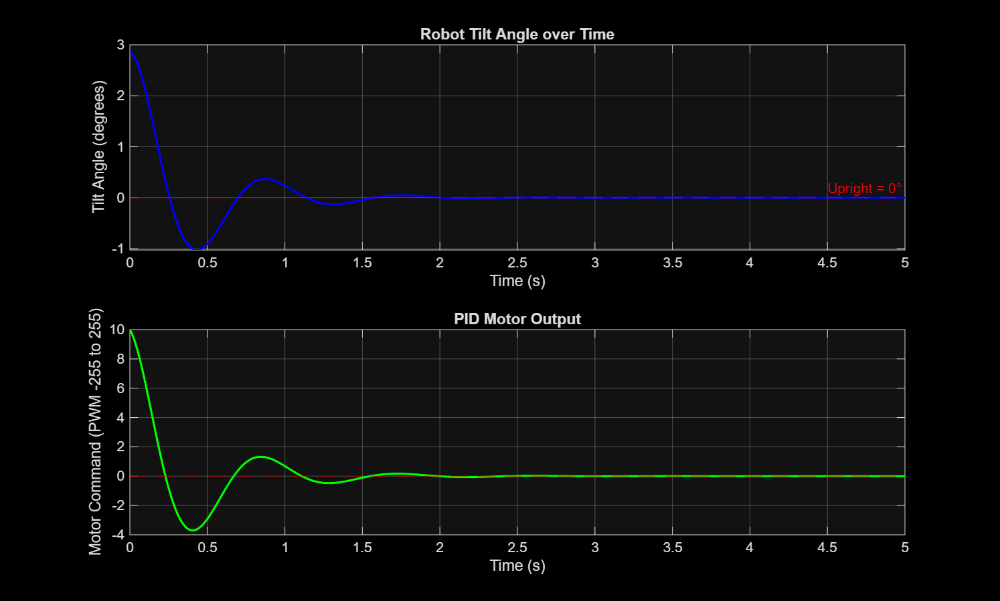

# Self-Balancing Robot

A two-wheeled inverted pendulum robot that balances upright using 
real-time PID control. Built as an independent project to apply 
control theory, embedded programming, and mechanical design.

## Status
🔬 Phase 1 Complete — Simulation & Modelling  
✅ Phase 2 Complete — Chassis Design (SolidWorks)  
🔨 Phase 3 Upcoming — Wiring & Hardware Assembly

## Stack
- **Microcontroller:** Arduino Nano (ATmega328P)
- **Sensor:** MPU-6050 IMU (accelerometer + gyroscope)
- **Actuators:** TT DC gear motors (200RPM) via L298N driver
- **Chassis:** Custom 4-part design in SolidWorks, 3D printed (PLA)
- **Control:** PID algorithm in Arduino C++
- **Data logging:** Python + matplotlib for tuning analysis

## Simulation & Modelling

Before building the hardware, the system was modelled mathematically 
as an inverted pendulum and simulated in both MATLAB and Simulink.

### MATLAB PID Script
Implemented a discrete-time PID simulation at 200Hz matching the 
Arduino control loop frequency. Systematically varied Kp, Ki, and Kd 
to understand each term's physical effect on the robot.

Key finding: Kp=40 insufficient to overcome gravity in this model. 
Kp=200 with Kd=6 produced stable damped oscillation settling within 
1.5 seconds. High Kd (≥25) over-damped the system eliminating 
corrective response entirely.

### Simulink Block Diagram Model
Built a full closed-loop Simulink model of the inverted pendulum 
with a PID Controller block, gravity torque via sin(θ) feedback, 
and dual integrators for the plant physics. Used the Simulink PID 
Tuner to explore the trade-off between response speed and stability.

**Hardware starting gains: Kp=200, Ki=0, Kd=6**

## Chassis Design

Designed a 4-part chassis from scratch in SolidWorks based on 
measured component dimensions. All parts exported as STLs and 
sent for 3D printing in PLA at 40% infill.

### Parts
- **Base plate** — 160×80×4mm, houses TT motor slots and tower mounting points
- **Motor mounts (×2)** — L-bracket design gripping each TT motor against the base plate
- **Vertical tower** — 40×8×150mm, mounts L298N, Arduino, battery, and MPU-6050 at calibrated heights
- **Sensor platform** — 30×25×3mm shelf at tower top, positions MPU-6050 perpendicular to wheel axle

### Design Decisions
- Tower height of 150mm chosen to raise centre of mass well above wheel axle (~32mm), 
  maximising reaction time for the PID controller
- MPU-6050 mounted at 140mm height to maximise distance from motor electrical noise
- Wire channel routed down tower left face to keep wiring clean during assembly
- All holes sized at 3.2mm clearance for M3 bolts with nut-on-back fastening

## Project Goals
- [x] Design MATLAB PID simulation
- [x] Build Simulink closed-loop model
- [x] Tune gains using Simulink PID Tuner
- [x] Design chassis in SolidWorks
- [x] Export STLs and send for 3D printing
- [ ] Assemble wired hardware on printed chassis
- [ ] Verify MPU-6050 IMU readings over serial
- [ ] Verify motor direction and speed control
- [ ] Implement full PID control loop on Arduino
- [ ] Tune PID gains on real hardware
- [ ] Log and visualize tuning data in Python
- [ ] Record demo video

## Build Log

**June 2026 (Week 1)** — Completed simulation phase. MATLAB and 
Simulink models confirm stable balance is achievable with Kp=200, Kd=6. 
Documented five tuning experiments showing effect of each gain term.

**June 2026 (Week 2)** — Completed chassis design in SolidWorks. 
Designed all four parts with verified dimensions, ran interference 
detection and mass properties check in assembly. STLs exported and 
parts sent for printing. Hardware components ordered and arriving shortly.

## Connect
- LinkedIn: [linkedin.com/in/nischay-rawat](https://linkedin.com/in/nischay-rawat)
- Email: nischay179@gmail.com
